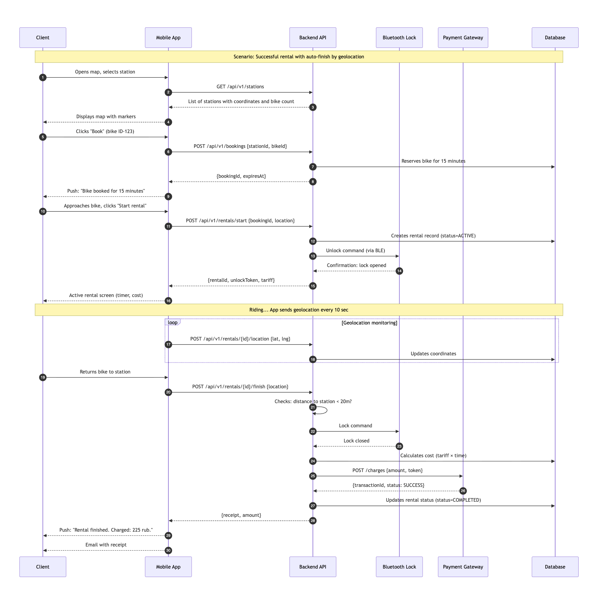

[⬅️ Вернуться к оглавлению](../README.md) | [← Предыдущая: Use Case](use-case.md)

# 2. Sequence Diagram — Успешная аренда с автозавершением

Диаграмма последовательности описывает полный цикл аренды: от выбора станции до автоматического завершения и списания средств. Отражает взаимодействие клиента, мобильного приложения, backend API, Bluetooth-замка, платежного шлюза и базы данных.

## Ключевые этапы сценария

1. **Поиск станции** — клиент открывает карту, видит ближайшие станции с количеством свободных велосипедов.
2. **Бронирование** — система резервирует велосипед на 15 минут, отправляет Push-уведомление.
3. **Старт аренды** — приложение отправляет команду разблокировки на Bluetooth-замок через BLE.
4. **Мониторинг** — во время поездки приложение отправляет геолокацию каждые 10 секунд.
5. **Автозавершение** — при возврате на станцию (радиус < 20м) система автоматически блокирует замок, рассчитывает стоимость и списывает средства.

---

[⬅️ Вернуться к оглавлению](../README.md) | [← Предыдущая: Use Case](use-case.md) | [Следующая: State Machine →](state-machine-rental.md)
