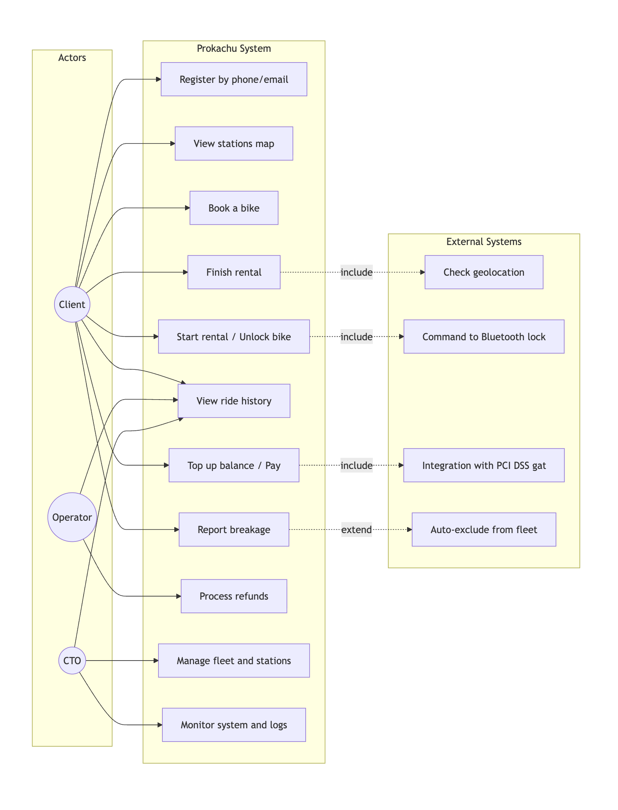

[⬅️ Вернуться к оглавлению](../README.md)

# 1. Use Case Diagram

Диаграмма вариантов использования описывает, какие действия доступны каждому актору системы (Клиент, Оператор, CTO) и какие внешние системы задействованы.

## Расшифровка акторов

| Актор           | Роль                                                                                                                                           |
| --------------- | ---------------------------------------------------------------------------------------------------------------------------------------------- |
| 👤 **Клиент**   | Основной пользователь сервиса. Регистрируется, ищет станции, бронирует и арендует велосипеды, оплачивает поездки, оставляет отчёты о поломках. |
| 🎧 **Оператор** | Сотрудник поддержки. Обрабатывает возвраты средств, просматривает историю поездок клиентов для разрешения споров.                              |
| ⚙️ **CTO**      | Технический директор. Управляет парком и станциями, мониторит логи и работоспособность системы.                                                |

## Расшифровка внешних систем

| Система                            | Назначение                                              |
| ---------------------------------- | ------------------------------------------------------- |
| Проверка геолокации                | Валидация возврата велосипеда на станцию (радиус < 20м) |
| Команда Bluetooth-замку            | Отправка сигнала разблокировки/блокировки через BLE     |
| Интеграция с PCI DSS шлюзом        | Безопасная обработка платежных данных                   |
| Автоматическое исключение из парка | Блокировка неисправного велосипеда после отчета         |

---

[⬅️ Вернуться к оглавлению](../README.md) | [Следующая: Sequence Diagram →](sequence-rental.md)
